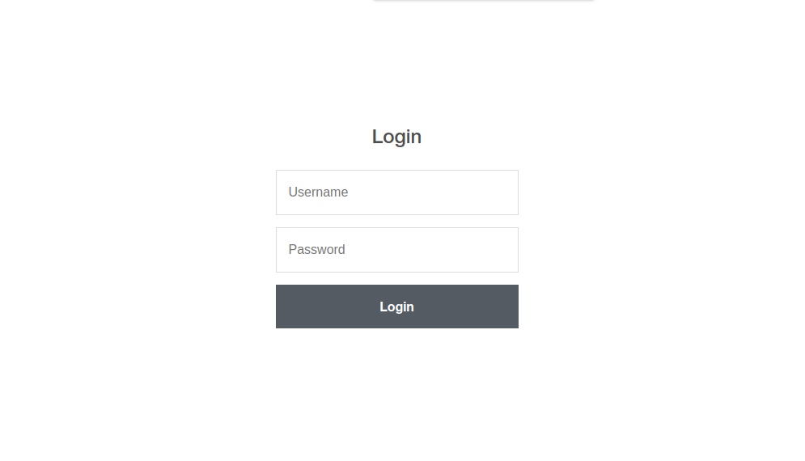
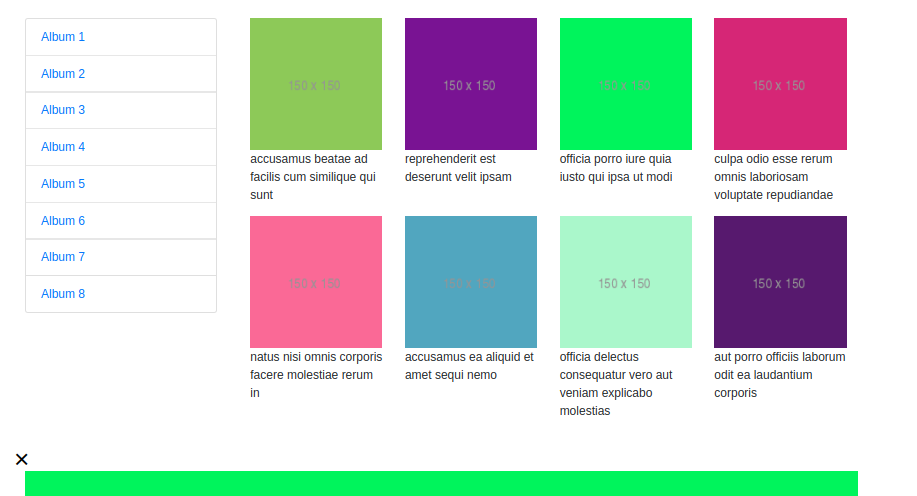
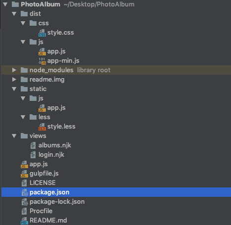

#  Photo Album
 NodeJs ve ExpressJs kullanarak API üzerinden album ve fotograf goruntuleme sitesi.
 
 Uygulamayı açmak icin : [](https://photo-album-challenge.herokuapp.com "Uygulamayı Aç")
 
 ## Görünüm
#### Login Ekranı



#### Anasayfa Ekranı



## Gerekli Araçlar
* NodeJs ve NPM
* Express

### Kullanılan Eklentiler
* Nunjucks
* Gulp
* Gulp-cli
* Gulp-csso
* Gulp-less
* Gulp-minify
* Gulp-watch
* Body Parser


## Başlangıç
Öncelikle güncel [nodejs](https://nodejs.org/en/download/ "nodejs") i yükleyiniz ve npm hazır halde gelecektir.
Daha sonra bir klasör açıp bu klasörde konsolu açın ve **sırasıyla** gerekli araçları yükleyelim :
`npm init` : ille package.json dosyasını olusturun
#### package.json dosyası
Gerekli olan tüm eklentiler `package.json`  dosyamızda mevcut. Direk bu kodu projenin oluşturulacağı klasörde package.json dosyasının içine yapıştırabilirsiniz.
```javascript
{
  "name": "challengeproj",
  "version": "1.0.0",
  "description": "",
  "main": "app.js",
  "scripts": {
    "test": "echo \"Error: no test specified\" && exit 1",
    "server": "nodemon app.js -e js,njk"
  },
  "author": "hasan",
  "license": "ISC",
  "dependencies": {
    "body-parser": "^1.19.0",
    "express": "^4.17.1",
    "nunjucks": "^3.2.0"
  },
  "devDependencies": {
    "gulp": "*",
    "gulp-cli": "^*",
    "gulp-csso": "*",
    "gulp-less": "*",
    "gulp-minify": "^3.1.0",
    "gulp-watch": "*",
    "install": "^0.13.0",
    "nodemon": "^1.19.1",
    "npm": "^6.10.1"
  }
}
```
Daha sonra:`npm install` diyip bu modulleri yukleyiniz.

Şimdi ise uygulamamızı yazmaya baslayabiliriz.

 ### İşlem sonundaki kod haritamız:
 


## Devam
Şimdi app.js olusturuyoruz ve kullanacagımız ana modulleri ve yönlendirmeleri tanımlıyoruz : 
```javascript
var express     = require('express');
var nunjucks    = require('nunjucks');
var bodyParser  = require('body-parser');

var app = express();

```
Daha sonra tarayıcı için sayfa yönlendirmelerini ekliyoruz:
```javascript
// Anasayfamız login sayfası
app.get("/", function(req,res) { 
    res.render("login");

});

app.get("/albums", function(req,res) {  // /albums sayfamız

    res.render("albums");

});

// Kullanıcı adı ve şifre dogruysa /albums sayfasına yonlendirecek
app.post("/albums", function (req, res) { 
  if ( req.body.username == "admin" && req.body.password == "admin"){
		res.render("albums");
    }
    else
        res.render("login", { message: 'Yanlış kullanıcı veya parola!' });
});


// local host 3000 portunda serverı acıyoruz
app.listen(process.env.PORT || 3000, function(){
    console.log("server %d portunda", this.address().port);
  });
```
Şimdi sayfadan alacagımız şifreyi kontrol etmek ve nunjucks ı kurmak için gereken kodları yazıyoruz:
```javascript
app.use(bodyParser.urlencoded({extended : true}));
app.use(bodyParser.json());

app.use(express.static('dist')); //js ve css dosyalarımızın oldugu yeri tanımlıyoruz

app.set("view engine", "njk"); //njk dosyalarımızı uzantı eklemeden yazabilmek için

 nunjucks.configure('views', {// njk yani html sayfalarının olacagı klasoru tanıtıyoruz 
    express: app
    });
```

Şimdi html templatelerimizi olusturmak için `views` klasörü içinde `login.njk` ve `albums.njk` adında iki dosyayı olusturuyoruz.

Login sayfamızın içeriği:
```html
<!doctype html>
<html lang="en">
<head>
    <title>Login</title>
    <!-- Required meta tags -->
    <meta charset="utf-8">
    <meta name="viewport" content="width=device-width, initial-scale=1, shrink-to-fit=no">

    <!-- Bootstrap CSS -->
    <link rel="stylesheet" href="https://stackpath.bootstrapcdn.com/bootstrap/4.3.1/css/bootstrap.min.css">
    <link rel="stylesheet" type="text/css" href="css/style.css">
</head>
<body>


<!--  Action komutumuz basarılı olursa yonlendirecegi adres ve post modu ile sunucuya istek attıgımızı belirtiyoruz -->
<div class="login-form">
    <h1>Login</h1>
    <form action="/albums" method="post">
        <input type="text" name="username" id="username" placeholder="Username" required>
        <input type="password" name="password" id="password" placeholder="Password" required>
       <input type="submit" value="Login" id="submit" onclick="validate()" /> <!-- app.js dosyasında validate fonksiyonumuzu calıstırarak karsılastırma yapacak -->
        <p class="ml-2 mt-2">( username: admin password: admin )</p>
    </form>
    <h1>{{message}}</h1> <!-- nunjucks ın tanıyacagı message degiskeni --> 
</div>


<!-- jQuery first, then Popper.js, then Bootstrap JS -->
<script src="https://stackpath.bootstrapcdn.com/bootstrap/4.3.1/js/bootstrap.min.js"></script>
<script src="js/app-min.js">
</body>
</html>

```
Albums sayfamızın içeriği:
```html
<!doctype html>
<html lang="en">

<head>
  <!-- Required meta tags -->
  <meta charset="utf-8">
  <meta name="viewport" content="width=device-width, initial-scale=1, shrink-to-fit=no">

  <!-- Bootstrap CSS -->
  <link rel="stylesheet" href="https://stackpath.bootstrapcdn.com/bootstrap/4.3.1/css/bootstrap.min.css">
  <link rel="stylesheet" type="text/css" href="css/style.css">

  <title>Photo Albums</title>
</head>


<body>

  <div class="container">
    <div class="row">
      <div class="col-sm-12 col-lg-3 pt-5">
          <div class="card">
              <ul class="list-group list-group-flush" id="albumListe">
                
              </ul>
            </div>

        </ul>
      </div>

      
      <div class="col-lg-9 col-12 pt-5">

        <div class="row mx-auto" id="cardDiv">
        
        </div>

        </div>
        </br>
		
		<!-- buyuk fotografın kapatılma butonu  -->
        <div class="container as">
          <span onclick="this.parentElement.style.display='none'" class="closebtn" id="closeBut">&times;</span>
          
          <div id="imgtext"></div>
        </div>
      </div>
  


<!-- tıklandıgında buyuk fotografın acılması icin -->
      <script>
        function myFunction(imgs) {
          var expandImg = document.getElementById("expandedImg");
          var imgText = document.getElementById("imgtext");
          expandImg.src = imgs.src;
          expandImg.parentElement.style.display = "block";
        }
      </script>
    </div>
  </div>

  </div>


  <!-- Optional JavaScript -->
  <!-- jQuery first, then Popper.js, then Bootstrap JS -->
  <script src="https://code.jquery.com/jquery-3.3.1.slim.min.js">
  </script>
  <script src="https://cdnjs.cloudflare.com/ajax/libs/popper.js/1.14.7/umd/popper.min.js">
  </script>
  <script src="https://stackpath.bootstrapcdn.com/bootstrap/4.3.1/js/bootstrap.min.js"></script>
  <script src="js/app-min.js" type="text/javascript"></script>
</body>

</html>
```

Şimdi `static`adında klasör olusturup sayfa tıklanmalarında apiye ulasmasıyla album ve fotografları get etmemiz için gerekli `app.js` dosyamızı olusturuyoruz:

App.js dosyamız:
```javascript
// Albumlerin acılacagı tıklama eventimiz sayfa acıldıgı anda yani load metoduyla apiden cekilecek
window.addEventListener("load", function () {
 // XHR native vanilla
  var XHR = new XMLHttpRequest();
  var albumListe = document.getElementById('albumListe');

  XHR.onreadystatechange = function () {
    if (XHR.readyState == 4 && XHR.status == 200) {

        var posts = JSON.parse(XHR.responseText);
        
	//for ile sadece 8 album cekilip innerhtml ile sayfaya liste olarak aktarılacak
        for (var i = 1; i < 9; i++) {
            albumListe.innerHTML += `<li class="list-group-item albumid" data-album-id="${i}"> 
                    <a href="#"> Album ${i}</a>
            
            </li>`;
            

        }

        // XHR native vanilla
		//yukardaki albumlere tıklandıgı anda o albume ait id ile fotografları cekecek
        var albumItems = document.querySelectorAll('.list-group-item.albumid');
        Array.from(albumItems).forEach(function(elm) {
            var albumId = elm.dataset.albumId;

            elm.addEventListener("click", function () {
                var XHR = new XMLHttpRequest();

                XHR.onreadystatechange = function () {
                    var cardDiv = document.querySelector('#cardDiv');

                    if (XHR.readyState == 4 && XHR.status == 200) {

                        var photos = JSON.parse(XHR.responseText);
                        photos = photos.filter(function(item) {
                            return item.albumId === parseInt(albumId);
                        });

                        cardDiv.innerHTML = "";
						
	//sadece 8 tane thumbnail fotolarımız cekilecek
                        for (var t = 0; t < 8; t++) {
                            cardDiv.innerHTML += `<div class="col-lg-3 col-6 album-thumb" data-full-url="${photos[t].url}">
                                                    
                                                    <p>${photos[t].title}</p>
                                            </div>`;
                        }

	//thumbnaillere tıklandıgında o thumbnailin ait oldugu id deki fullurlimizi alt tarafa cekecek
                        var albumThumbs = document.querySelectorAll('.album-thumb');
                        Array.from(albumThumbs).forEach(function(elm) {
                            elm.addEventListener('click', function() {
                                var albumFullUrl = elm.dataset.fullUrl;
                                var expandedImg= document.getElementById('expandedImg');
                
                                if (!expandedImg) {
                                    return;
                                }
                                
                                expandedImg.setAttribute('src', albumFullUrl);
                                expandedImg.parentElement.style.display='block';
                            })
                        });

                    }
                };

                XHR.open("GET", `https://jsonplaceholder.typicode.com/albums/${albumId}/photos`);
                XHR.send();

            });
        });
    }
  }

  XHR.open("GET", "https://jsonplaceholder.typicode.com/albums");
  XHR.send();
});
```
Şimdi `style.less` dosyamızı `static` klasörü icindeki `less` klasorune olsuturalım :

```less

.login-form {

    width: 300px;
    margin: 200px auto;

}

.login-form h1 {
    text-align: center;
    color: #4d4d4d;
    font-size: 24px;
    padding: 20px 0 20px 0;
}

.login-form input[type="password"],
.login-form input[type="text"] {
    width: 100%;
    padding: 15px;
    border: 1px solid #dddddd;
    margin-bottom: 15px;
    box-sizing:border-box;
}

.login-form input[type="submit"] {
    width: 100%;
    padding: 15px;
    background-color: #535b63;
    border: 0;
    box-sizing: border-box;
    cursor: pointer;
    font-weight: bold;
    color: #ffffff;
}

li {
    list-style-type: none;
}

  
  /* The grid: Four equal columns that floats next to each other */
  .column {
    float: left;
    width: 25%;
    padding: 10px;
  }
  
  /* Style the images inside the grid */
  .column img {
    opacity: 0.8; 
    cursor: pointer; 
  }
  
  .column img:hover {
    opacity: 1;
  }
  
  /* Clear floats after the columns */
  .row:after {
    content: "";
    display: table;
    clear: both;
  }
  
  /* The expanding image container */
  #as {
    position: relative;
    display: none;
    

  }
  /* Expanding image text */
  #imgtext {
    position: absolute;
    bottom: 15px;
    left: 15px;
    color: white;
    font-size: 20px;
  }
  
  /* Closable button inside the expanded image */
  .closebtn {
    position: absolute;
    top: 10px;
    right: 15px;
    color: white;
    font-size: 35px;
    cursor: pointer;
    
  }
```
## Gulp.js ile Js ve Less dosyalarımızı minify etme
js dosyalarımızı tek dosya haline giterelim ve less dosyalarımızı css dosyasına cevirip minify edecegiz:

`gulpfile.js`dosyamızı ana dizinde olusturuyoruz ve gerekli olan tum kodlar:

```javascript
const { src, dest, parallel } = require('gulp');
const less = require('gulp-less');
const minifyCSS = require('gulp-csso');
const uglify = require('gulp-minify');


function css() {
  return src('static/less/*.less')
      .pipe(less())
      .pipe(minifyCSS())
      .pipe(dest('dist/css'))
}

function minify() {
  return src('static/js/*.js', { sourcemaps: true })
  // Minify the file
      .pipe(uglify())
      // Output
      .pipe(dest('dist/js', { sourcemaps: true }))
}


exports.css = css;
exports.minify = minify;

exports.default = parallel(css, minify);
```

Dosyaları sıkıstırmak icin ise konsola default olarak da tanımladıgımız `gulp`komutunu calıstıyoruz ve `dist` klasoru icinde minify dosyalar olusturuluyor.

>js ve css dosyalarımızı njk dosyalarımızın icinde tanımlamayı unutmayın.

### Uygulamamız hazır :stuck_out_tongue_winking_eye:
Açmak için:
[](https://photo-album-challenge.herokuapp.com "Uygulamayı Aç")

------------

 Created by [@hasanaydins](https://hasanaydins.com/)  &copy;
