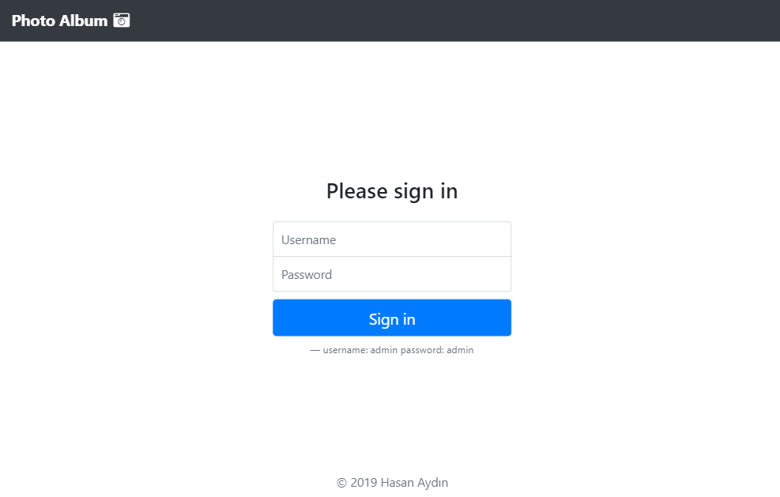
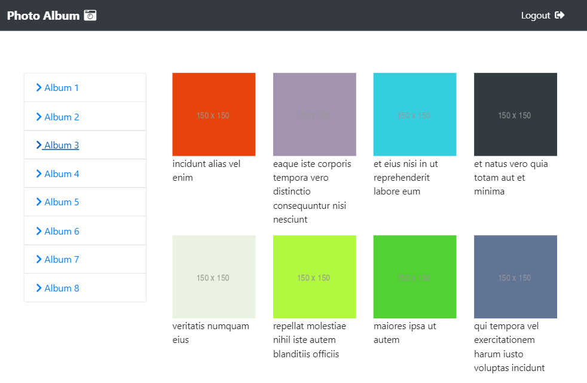
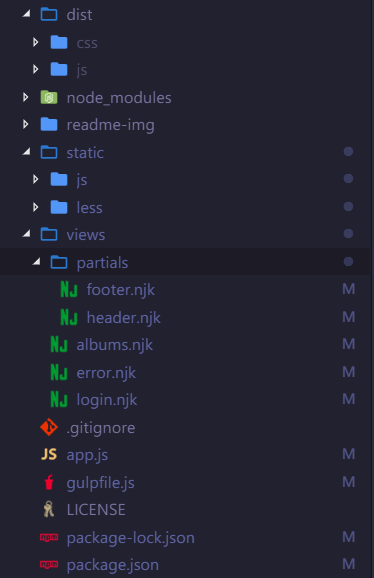

#  Photo Album


 NodeJs ve ExpressJs kullanarak API üzerinden album ve fotograf goruntuleme sitesi.
 
 Uygulamayı açmak icin : [](https://hsn-photo.herokuapp.com "Uygulamayı Aç")

 
 ## Görünüm
#### Login Ekranı



#### Anasayfa Ekranı



## Gerekli Araçlar
* NodeJs ve NPM
* Express

### Kullanılan Eklentiler
* Nunjucks
* Gulp
* Gulp-csso
* Gulp-less
* Gulp-minify
* Gulp-watch
* Body Parser
* Passport


## Başlangıç

#### package.json dosyası
Gerekli olan tüm eklentiler `package.json`  dosyamızda mevcut. Direk bu kodu projenin oluşturulacağı klasörde package.json dosyasının içine yapıştırabilirsiniz.
```javascript
{
    "name": "challengeproj",
    "version": "1.0.0",
    "description": "",
    "main": "app.js",
    "scripts": {
        "test": "echo \"Error: no test specified\" && exit 1",
        "server": "nodemon app.js -e js,njk"
    },
    "engines": {
        "node": ">= v10.16.0",
        "npm": ">= 6.9.0"
    },
    "repository": {
        "type": "git",
        "url": "https://github.com/hasanaydins/PhotoAlbum.git"
    },
    "bugs": "https://github.com/hasanaydins/PhotoAlbum/issues",
    "author": "hasan",
    "license": "ISC",
    "dependencies": {
        "body-parser": "^1.19.0",
        "express": "^4.17.1",
        "nunjucks": "^3.2.0"
    },
    "devDependencies": {
        "gulp": "^4.0.2",
        "gulp-csso": "*",
        "gulp-less": "*",
        "gulp-minify": "^3.1.0",
        "nodemon": "^1.19.1",
        "passport": "^0.4.0"
    }
}

```
`npm install` diyip bu modulleri yukleyeyebilirsiniz.

 ### İşlem sonundaki kod haritamız:
 

# Arayüz
 Html templateleri için `views` klasoru altında `partials` , `login` ve `albums` sayfalarımızı olusturuyoruz.


# API Bağlantısı
`static` adında klasör olusturup sayfa tıklanmalarında apiye ulasmasıyla album ve fotografları get etmemiz için gerekli `app.js` dosyamızı olusturmamız gerekiyor.


# Dosyalarımızı sıkıştırma ve tek parça haline getirme
#### Gulp.js ile Js ve Less dosyalarımızı minify etme

Js dosyalarımızı tek dosya haline giterelim ve less dosyalarımızı css dosyasına cevirip minify edecegiz.
Daha sonra watch ile izleyecegiz.

Dosyaları sıkıstırmak icin ise konsola default olarak da tanımladıgımız `gulp`komutunu calıstıyoruz ve `dist` klasoru icinde minify dosyalar olusturuluyor.

>js ve css dosyalarımızı njk dosyalarımızın icinde tanımlamayı unutmayın.

### Uygulamamız hazır :stuck_out_tongue_winking_eye:
Açmak için:
[](https://hsn-photo.herokuapp.com "Uygulamayı Aç")

------------

 Created by [Hasan Aydın](https://hasanaydins.com/)  &copy;
